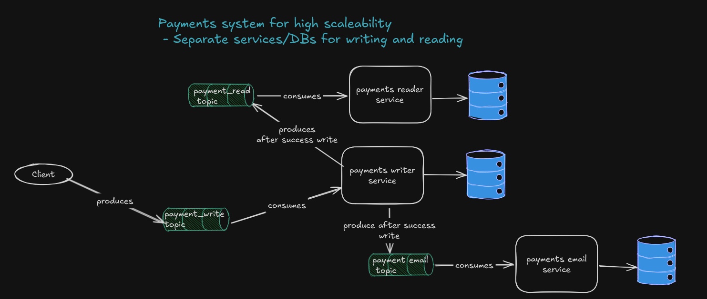

## Voltpay Payment Writer

This Service is responsible for writing payments for Voltpay.
The reading logic is offloaded to a separate service to ensure that there is no contention for CPU/Resources 
between reading and writing, so both are in separate services and can independently scaled and deployed.
Neither of these microservices know of each other's existence as they communicate through Kafka topic.
Writer writes to payment_read_topic after we have commited successfully changes to the Writer DB.
This means that the Writer does NOT wait for the Reader to persist the changes, so if you write and after 
1 nanosecond try to read the data you probably can't as the data for reading is eventually consistent.
There is an idempotency check every time we try to process a message to ensure we don't reprocessed already processed messages.
The reprocessing can happen because of rebalancing, restarts, retries etc.
There is an idempotency job that deletes idempotency records older than one week.
Kafka consumer should consume messages in batches and IF there are messages for one account those can be commited at the same time OR in batches (10-20-50 TBD)
After successful write publish to payment_email topic which will be consumed by payment email service and it will
send emails to the customer that made the succesful payment.

# Architecture

# Kafka 
  - Consume messages from payment_writer_topic.
  - Check for idempotency of the message, just in case some messages are re-emitted OR the consumer offset gets moved back
  - The topic has 100 partitions with 2 replicas and 1 day retention
  - There are 2 Kafka brokers as a start, more can be added in the future
  - On startup there will be warmup events for the brokers to ensure no infra issues with Kafka during big loads.
  - The MESSAGE_ID of the messages is the ACCOUNT_ID which ensures transactions for one account are written sequentially so NO race conditions as all of the messages for that ACCOUND_ID go into one partition and processing for a single partition is sequential.
  - Consumer should Batch consumer and take messages in batches, the messages will then be grouped by key in Map<Key,List<Value>>
  - We are using custom Serializer/Deserializer that filer out NON-NULL, NON-EMPTY fields to reduce message size.
  - **We COMMIT TO THE DB ONCE WE HAVE PROCESSED THE ENTIRE batch** (remember only for 1 account) this delays processing for some transactions, but it's worth it.
  - Otherwise we'll have to open/close and commit once per message which is expensive if we want huge throughput
  - IF a message fails we put only that message to the dead letter and acknowledge the batch and move forward
  - TODO: Reprocessing strategy for failed messages -> TBD but most likely re-emit in the original topic.

# Database 
  - PostgreSQL is the chosen DB for it reliability and flexibilty.
  - We want our DB schema to be normalized as possible.
  - This allows us to not have contention on row level when writing because we are writing to many tables at once.
  - Idempotency table consists of Message_ID, DATE
  - NO INDEXES on the main WRITER tables besides Primary Key! Each index slows down updates and could slow down create significantly, rebalancing an index is costly.
  - This makes it possible to insert two records for ID X in metadata and notes, the app will have to ensure that doesn't happen.
  - The IDs for the payments will be ULIDS instead of UUID
    because ULIDS are still unique, can be converted to timestamp to see when they were created, can be sorted lexicographically and are better for indexing
  - ULID generation will be done in the app, there is an astronomically low chance to create the same ULID twice, this case will be handled 
  - I'd rather avoid a DB bottleneck for the ULID generation in the DB, also generating it in the app is more flexible as in the future we can choose to write it to another storage
  - Why collison could happen: ULID = 48 bits of timestamp + 80 bits of randomness the odds of a collision happening is 2^80 (1 in 1.2 quintillion)
  - NO FOREIGN KEY constraints between the tables, it's more optimal to keep things loose and ensure on app level that ID for the records is consistent in the different tables.
  - Tables to be PARTITIONED, it will reduce contention on the same table and distributed writes to different tables (partitions)
  - Tables to be partitioned on a MONTHLY basis by CREATED_AT column
  - One downside of partitioning is that the PRIMARY KEY has to also include CREATED_AT column to ensure uniqueness across partitions, making the index bigger
  - pgpartman(https://github.com/pgpartman/pg_partman) extension will be used to created and manage partitions, new partitions for the 2 months will be created at the start of every month
  - For the ID it will be ULID-XXX where XXX is the node ID, even though it's almost impossible to have a collision if we have millions of transactions per secon and hundres of instances of the service it COULD happen theorically
  - Adding the node id ensures that it won't happen as in one process(instance) we are guaranteed to generate unique ULIDs

# Liquibase
  - The chosen approach for version control of the database 
  - Easy to use and we have rollbacks it necessary 
  - We have an audit trail
  - It's easy to integrate in the CI/CD and it ensures consistent DB changes across all environments
  - Liquibase doesn't directly support schema creation or the management of extensions so they have to be done manually 
  - otherwise liquibase will throw exception for not existing schema when you execute the scripts, schema CANNOT be created in liquibase
  - ChangeSet Ids to be order ascendingly from file to file, if file 1 ends at changeset 3, file 2 needs to start from change 4 to ensure that when querying databasechangelog we can easily track the change
  - commands
     - ``gradle update`` -> apply changes
     - ``gradle clearChecksums update`` -> if you change a changelog already execute it will throw an exception when you reexecute it   
     - ``gradle rollbackCount -PliquibaseCommandValue=1`` -> very important for rolling back ONE change
     - ``SELECT * FROM databasechangelog ORDER BY dateexecuted DESC;`` -> to monitor when a change was executed

# Monitoring - TODO
  - TBD but most likely 
  - Prometheus + Grafana -> Request Rate, Latency, Error Rates, Consumer Lag 
  - Kafka Lag Exporter -> Monitor Kafka lag, partition throughput, broker performance, consider Kafdrop also 
  - OpenTelemetry + Zipkin -> Trace full lifecycle of flows, helps to detect bottlenecks, slow queries
  - Loki - used for general logs with correlation IDs
  - Node Exporter - Infra monitoring for CPU, RAM, Disk, network etc

# Alerts - TODO 
  - High Error Rate
  - High Kafka Consumer Lag
  - Latency Spikes
  - Low throughput 
  - DB slow queries 
  - Out of memory errors

# Other ideas that were considered and DROPPED

1. **Use trigger to persist data to reader table**
  - The trigger is persisting in the read table records one by one, consumer for reads can commit in batches 
  - having a consumer is more flexible, we can choose in the future to commit the data to another storage i.e to a separate database just for reading 
  - monitoring a trigger behavior is a big question mark ?? However monitoring a Java Consumer for Kafka is much more straight-forward
  - also I don't know how to test the trigger, but I do know how to write a unit/integration test for Kafka consumer written in Java.
  - for the consumer we can rely on Kafka retries(3 by default) if the trigger fails once it will have to go to a Dead Letter Table (not bad but you have more dependency on the DB instead of Kafka)
2. **Use UUID for Write DB and ULID for READ DB**
  - Initially the idea was that we don't need indexes which greatly benefit from ULID and we can just use UUID, but then use ULIDs for READs for faster index node insertion.
  - I dropped this because I'll have to do some magic converstions which will slow down the system 
  - Better to use ULIDs because even though they have no benefit for Write they have benefit for Read and the IDs for records are the same in both systems so no mappings needed
3. **Remove the index on PRIMARY KEY on "payment_core" table to speed up writes** 
  - Ultimately I decided against this, because we will use ULID for the ID which shows good performance for the writes i.e there isn't that much rebalancing of the index and also this index will be beneficial for updates
4. **Generate ULID in the DB using https://github.com/andrielfn/pg-ulid.git**
  - Ultimately I decided to generate it on app level 
  - I already have a created_at column and I don't see perfect ULID sort order
  - I'd rather avoid a DB bottleneck for the ULID generation in the DB, also generating it in the app is more flexible as in the future we can choose to write it to another storage
5. **Use Hash based partitioning for tables**
  - I wanted to use this initially because partitioning by months, days, hours seemed like it would lead to too many partitions 
  - problem with hash based partitioning is that when you declare how many partitions you want you can't increase them and repartition the data 
  - I'll have to manually repartition so make a new table with more partitions, start writing to it, migrate the data to it, route client to the new table and then delete the old table.
  - that seemed like too much maitenance work so I dropped this idea.
6. Use @Transactional for the consumer 
  - Unfortunately the transaction is commited after the method execution and it's possble that we have failed events that won't be persisted 
  - I need to know all of the successfully persisted events so that I produce them to the reader-topic, otherwise I have to publish also the failed events and there will be a difference between WRITE and READ db
  - so doing manual transactions to the DB using EntityManager was preferrable

# How to Set up Locally

# Kafka 
 - As mentioned we need to create 5 Brokers and 1 Topic for writing with 100 partitions
 - The other topics will be created by the Apps that will use them 
 - [START] ``docker compose up -d``
 - [TOPIC CREATION] ``docker exec -it kafka1 kafka-topics --create --topic write-topic --bootstrap-server kafka1:29092,kafka2:29093 --partitions 100 --replication-factor 1``
 - [VERIFY] ``docker exec kafka1 kafka-topics --list --bootstrap-server kafka1:29092``
 - [TOPIC DELETION] ``docker exec -it kafka1 kafka-topics --delete --topic payment_writer --bootstrap-server localhost:9092``
 - [END] ``docker compose down``

# PostgreSQL
 - ``docker compose up -d``
 - add liquibase dependencies/plugin to build.gradle
 - ``gradle build --refresh-dependencies``
 - ``gradle update`` OR ``gradle clearChecksums update``(if there is a problem with checksums) - to trigger liquibase scripts
 - ``docker exec -it postgres bash``
 - [CONNECT TO DB] ``psql -U user -d write_db``
 - ``CREATE SCHEMA IF NOT EXISTS write;`` -> general setup for the schema the app will be using

# Set up PG Partman
 - ``docker exec -it postgres bash``
 - ``apt-get update``
 - ``apt-get install postgresql-16-partman``
 - ``apt-get install git``
 - ``apt-get install make``
 - ``apt-get install -y gcc make postgresql-server-dev-16 libxml2-dev``
 - ``git clone https://github.com/pgpartman/pg_partman.git``
 - ``cd pg_partman``
 - ``make``
 - ``make install``
 - [CONNECT TO DB] ``psql -U user -d write_db``
 - ``CREATE SCHEMA IF NOT EXISTS partman;``
 - ``CREATE EXTENSION IF NOT EXISTS pgcrypto SCHEMA partman;``
      - pgcrypto is needed to generate UUIDs names for child partitions, indexes etc  
 - ``CREATE EXTENSION IF NOT EXISTS pg_partman SCHEMA partman;``
 - ``SELECT * FROM pg_available_extensions WHERE name = 'pg_partman';`` to verify
