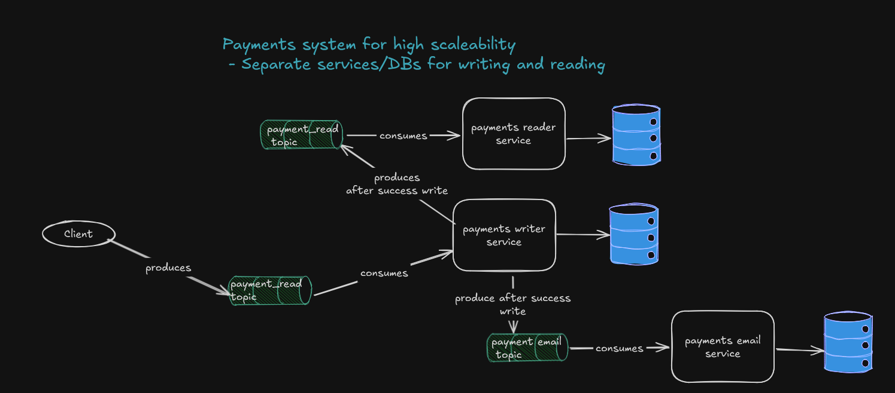

## Voltpay Payment Writer

This Service is responsible for writing payments for Voltpay.
The reading logic is offloaded to a separate service to ensure that there is no contention for CPU/Resources 
between reading and writing, so both are in separate services and can independently scaled and deployed.
Neither of these microservices know of each other's existence as they communicate through Kafka topic.
Writer writes to payment_read_topic after we have commited successfully changes to the Writer DB.
This means that the Writer does NOT wait for the Reader to persist the changes, so if you write and after 
1 nanosecond try to read the data you probably can't as the data for reading is eventually consistent.
There is an idempotency check every time we try to process a message to ensure we don't reprocessed already processed messages.
The reprocessing can happen because of rebalancing, restarts, retries etc.
There is an idempotency job that deletes idempotency records older than one week.
Kafka consumer should consume messages in batches and IF there are messages for one account those can be commited at the same time OR in batches (10-20-50 TBD)
After successful write publish to payment_email topic which will be consumed by payment email service and it will
send emails to the customer that made the succesful payment.

# Architecture

# Kafka 
  - Consume messages from payment_writer_topic.
  - Check for idempotency of the message, just in case some messages are re-emitted OR the consumer offset gets moved back
  - The topic has 100 partitions with 2 replicas and 1 day retention
  - There are 5 Kafka brokers to ensure more throughput
  - The MESSAGE_ID of the messages is the ACCOUNT_ID which ensures transactions for one account are written sequentially so NO race conditions
  - Consumer should Batch consumer and take messages in batches

# Database 
  - PostgreSQL is the chosen DB for it reliability and flexibilty.
  - We want our DB schema to be normalized as possible.
  - This allows us to not have contention when writing because we are writing to many tables at once.
  - Idempotency table consists for Message_ID, DATE
  - NO INDEXES on the main WRITER tables! Each index slows down updates and could slow down create significantly, rebalncing an index is costly.
  - CONSIDER WHETHER IT WILL BETTER TO PARTITION WRITER TABLES ??
   
# Liquibase
  - The chosen approach for version control of the database 
  - Easy to use and we have rollbacks it necessary 
  - We have an audit trail
  - It's easy to integrate in the CI/CD and it ensures consistent DB changes across all environments

# Monitoring - TODO
  - TBD but most likely 
  - Prometheus + Grafana -> Request Rate, Latency, Error Rates, Consumer Lag 
  - Kafka Lag Exporter -> Monitor Kafka lag, partition throughput, broker performance, consider Kafdrop also 
  - OpenTelemetry + Zipkin -> Trace full lifecycle of flows, helps to detect bottlenecks, slow queries
  - Loki - used for general logs with correlation IDs
  - Node Exporter - Infra monitoring for CPU, RAM, Disk, network etc

# Alerts - TODO 
  - High Error Rate
  - High Kafka Consumer Lag
  - Latency Spikes
  - Low throughput 
  - DB slow queries 
  - Out of memory errors

# Other ideas that we considered

1. Use trigger to persist data to reader table
  - dada
2. dadada
  - da